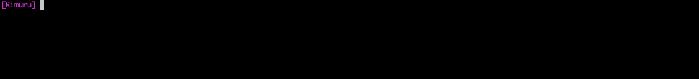

# 🧊Rimuru
🧊Rimuru is a tool that converts text into a different naming convention

<p align="center">
  
  <a href="https://developer.apple.com/swift">
    
  </a>
  <a href="./LICENSE">
    
  </a>
  <a href="https://twitter.com/_funzin">
    
  </a>
</p>

## Environment
- Xcode 11.5 or greater
- Swift 5.2 or greator

## GIF


## Usage
```
OVERVIEW: A tool for converting the input text to different naming convention

e.g Rimuru --from lower --to upper exampleTestCase

USAGE: rimuru --from <from> --to <to> <text>

ARGUMENTS:
  <text>                  The text to be converted

OPTIONS:
  -f, --from <from>       Input text naming convention
                          Select the following naming convention
                          (upper|lower|screamingSnake|snake|kebab|train)


  -t, --to <to>           Output text naming convention
                          Select the following naming convention
                          (upper|lower|screamingSnake|snake|kebab|train)


  --version               Show the version.
  -h, --help              Show help information.
```

### Support for Naming Convention
|Naming Convention|
|:-:|
|UpperCamelCase|
|LowerCamelCase|
|ScreamingSnakeCase|
|SnakeCase|
|KebabCase|
|TrainCase|

### Example
```
$ rimuru --from upper --to snake ExampleTestCase
example_test_case
```

## Installation
### Swift Package Manager
Put the following code in `Package.swift`.
```Package.swift
dependencies: [
    .package(url: "https://github.com/funzin/Rirumu.git", from: "1.0.0"),
]
```

### Mint
Put the following code in `Mintfile`.
```
funzin/Rimuru@1.0.0
```

## Development
1. `git clone https://github.com/funzin/Rimuru`
2. `make setup`
3. `open Rimuru.xcodeproj`

## Contact
If you discover problem or have opinions, please let me know through Github issues💁‍♂️

## Author
funzin
- mail: nakazawa.fumito@gmail.com

## License
Rimuru is available under the MIT license. See the [LICENSE](./LICENSE) file for more info.
